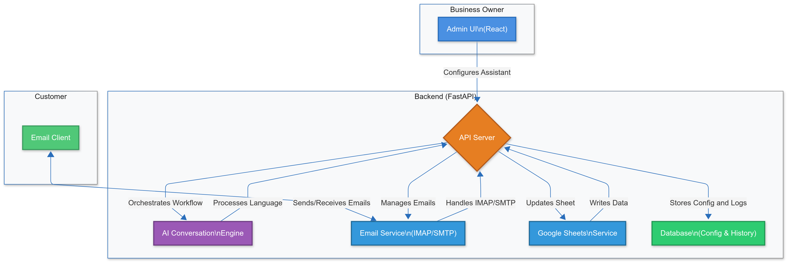
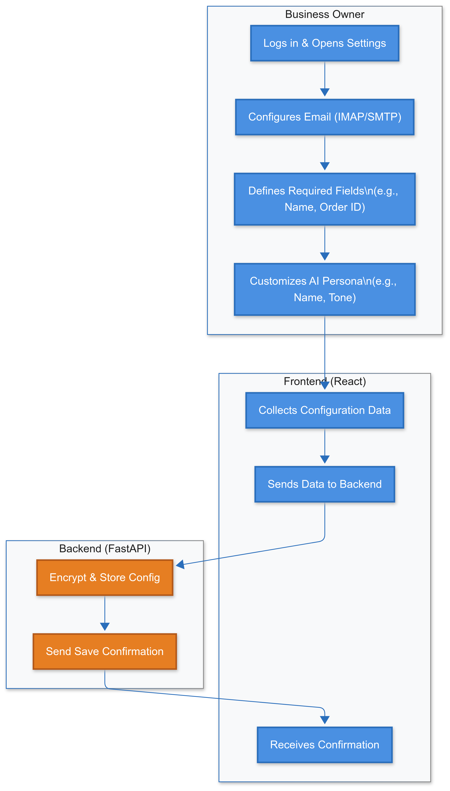
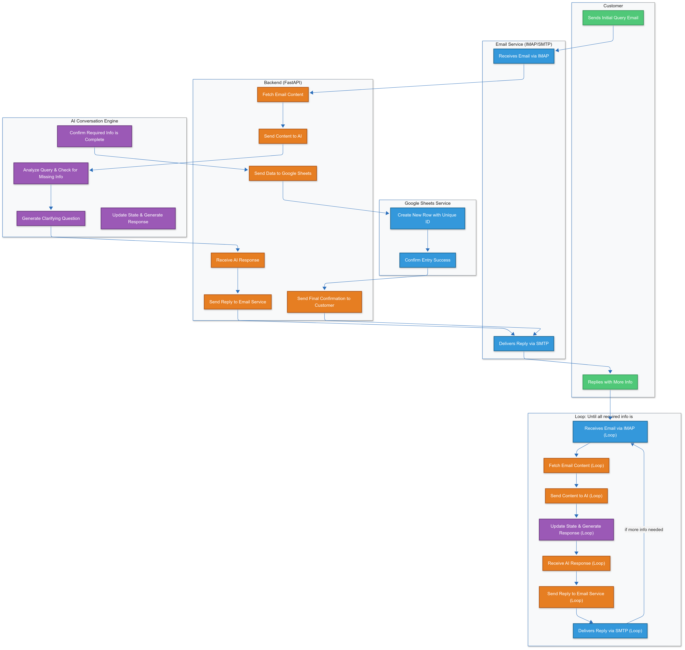

# Personalized E-commerce AI Assistant

This project is a full-stack application designed to provide a personalized virtual assistant for e-commerce businesses. It automates customer service by handling email inquiries, engaging in conversations to gather necessary information, and updating business systems (like Google Sheets) with the final details.

## 🚀 The Problem

E-commerce businesses often face a high volume of repetitive customer inquiries regarding orders, services, or product information. Manually handling these emails is time-consuming and prone to error. This project solves that problem by deploying an AI assistant that can:

- **24/7 Availability**: Understand and respond to customer emails around the clock.
- **Intelligent Conversation**: Intelligently converse with customers to gather all required information (e.g., order details, shipping address, customization choices).
- **Automated Data Entry**: Automate data entry into backend systems upon successful information gathering.
- **Customization**: Be fully customized by the business owner to fit their specific needs and brand persona.

## 🏗️ Architecture & Workflow

The system is comprised of a **React frontend** for configuration by the business owner and a **FastAPI backend** that orchestrates the email communication, AI conversation, and data integration.

### High-Level Architecture


### Business Owner Configuration Flow


### Customer Interaction & Data Entry Flow


## 📂 Folder Structure

```text
Virtual-Assistant/
├── backend/            # FastAPI backend application
│   ├── api/            # API endpoints
│   ├── core/           # Core configuration and settings
│   ├── services/       # Business logic and external service integrations
│   ├── assistant.db    # SQLite database for the assistant
│   ├── auth_helper.py  # Authentication utilities
│   ├── main.py         # Entry point for the FastAPI application
│   └── requirements.txt# Python dependencies
├── frontend/           # React + Vite frontend application
│   ├── public/         # Public static assets
│   ├── src/            # Source code for React components and logic
│   ├── package.json    # Node.js dependencies and scripts
│   ├── tailwind.config.js # Tailwind CSS configuration
│   └── vite.config.js  # Vite bundler configuration
└── docs/               # Project documentation and resources
    ├── images/         # Images used in documentation
    └── ...             # Other notes, reports, and brainstorming documents
```

## ⚙️ Setup Instructions

To run the entire project, you need to set up both the frontend and the backend.

### Prerequisites

- Node.js and npm
- Python and pip
- A Google Cloud Platform account with the Gmail API and Google Sheets API enabled. (For detailed instructions, see the [backend README](./backend/README.md)).

### Backend Setup

1. **Navigate to the backend directory:**
   ```bash
   cd backend
   ```

2. **Create and activate a virtual environment:**
   ```bash
   python -m venv venv
   source venv/bin/activate  # On Windows, use `venv\Scripts\activate`
   ```

3. **Install dependencies:**
   ```bash
   pip install -r requirements.txt
   ```

4. **Run the development server:**
   ```bash
   uvicorn main:app --reload
   ```

### Frontend Setup

1. **Navigate to the frontend directory:**
   ```bash
   cd frontend
   ```

2. **Install dependencies:**
   ```bash
   npm install
   ```

3. **Run the development server:**
   ```bash
   npm run dev
   ```

Now you can access the admin application in your browser at `http://localhost:5173`, and the backend API will be running at `http://localhost:8000`.
